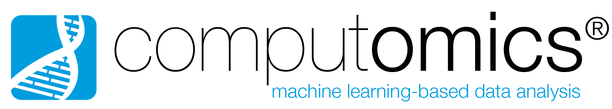

# Discontinued!
> :warning: **THIS PROJECT IS DISCONTINUED.**: For details please see https://github.com/graph-genome/graph-genome.github.io/issues/30.

 

## Online Browser Demo
* Use [Pantograph](https://graph-genome.github.io/Schematize) to browse 169 SARS-CoV-2 aligned genomes.
* Thanks to the [Public Sequence Resource team](https://github.com/arvados/bh20-seq-resource/graphs/contributors) for the [data set](https://workbench.lugli.arvadosapi.com/projects/lugli-j7d0g-825x3r5vcs41dus).

## What is the Pantograph Project?

* Our History

    * The Pantograph Project began in 2019 with the mission to provide a next generation tool for unlocking population genetic information for researchers. Pantograph is an open source browsable pangenome visualization for graph genomes. It scales to thousands of individuals while preserving all types of sequence variation. Other tools either are not scalable or discard all genome rearrangements. 
    * In March 2020 we realized that Pantograph could make a significant contribution to the work being done by researchers and vaccine developers in the global fight against SARS-Cov-2. Pantograph’s application to the COVID-19 pandemic is driven by the unique evolutionary scenario we are facing. The infected population size is a multiplier for the number of mutations available for selection. Pantograph can help predict vaccine effectiveness in different regions of the world by integrating our total knowledge of genetic diversity.
    * Our team participated in the COVID-19 Virtual Biohackathon 2020 held in April. We made an open call on Twitter to join the Pantograph build and 21 bioinformaticians, programmers, and grant writers from 2 continents volunteered to donate a week’s worth of their time to the round-the-clock effort. The results included 100x improvement in speed and two new major features. Following the hackathon, 10 people committed to continuing to work on Pantograph by donating 10-40 hours a week of their own time. We are currently seeking funding to support that work full-time in order to accelerate development.
    * [Learn More](https://graph-genome.github.io/pantograph.html) about pangenomes and how we capture the genetic diversity of a species in a single graphic.

* Our Mission

    * Provide a public server with an instance of Pantograph (Open Source) available to all genetic researchers and vaccine developers
    * Generate a SARS-CoV-2 pangenome from the largest dataset available of de novo genome assemblies
    * Render gene annotations 
    * Include phylogenetic tree with regional labels
    * Create process for data governance in live-updating of all available data
    * Integrate knowledge graph of COVID-19 patient outcomes

## Accomplishments To Date
* Developed a new method for visualizing a Pangenome that can scale to thousands of samples
* [169 SARS-CoV-2 genomes](https://workbench.lugli.arvadosapi.com/projects/lugli-j7d0g-825x3r5vcs41dus) gathered by [Public Resource Team](https://github.com/arvados/bh20-seq-resource/graphs/contributors), collected and filtered from NCBI
* Pantograph: A [team](team) of 8+ people developed Open Source software for browsing Graph Genomes
* [Pantograph - Release 1.0 - June 12, 2020](release_1_0)
* Pantograph Documents and Code

## Get Involved

* How can you help? We need:
    * Grant writers to help with funding search
    * Biologists to do [beta-testing](betatest)
    * Software engineers (with JavaScript or C++ knowledge) for [Release 1.1](release_1_1)

## Our Supporters

<strong>The Pantograph project is supported by</strong>

    

    

    

    

    

    

    The <a href="https://www.denbi.de/cloud">deNBI Cloud</a> has provided VMs for developing this project and is currently providing a VM of 28 cores, 64GB RAM and 1TB storage for our <strong>COVID19 Pangenome Visualization</strong>.
    The deNBI cloud <a href="https://cloud.denbi.de/covid-19-resources/">covid-19-resources</a> lists us as one of the available resources to fight COVID19.

Pangenome Schematic design and development research was funded through the 1001 Genomes project under grant BBSRC BB/S004661/1.

NBDC/DBCLS BioHackathon 2019 is supported by the Integrated Database Project (Ministry of Education, Culture, Sports, Science and Technology of Japan) and hosted by the National Bioscience Database Center (NBDC) and the Database Center for Life Science (DBCLS).

Computomics GmbH funded a second hackathon to implement the data pipeline in November 2019.

Toshiyuki Yokoyama’s work was funded in part by JSPS KAKENHI (grant numbers 16H06279 and 19J21608).

If you wish to donate to the Pantograph project, e.g. for
    infrastructure like setting up and maintaining a public server:

    <a class="btn btn-primary btn-lg" href="https://paypal.me/Computomics" rel="noopener noreferrer" target="_blank" role="button">Donate to Pantograph Project</a>

If your company or organization would like to get involved in developing this tool,
    please contact us: <a href="mailto: pantograph@computomics.com">pantograph@computomics.com</a>.

## Documentation Index
* [Getting Started with Pantograph (wiki)](https://github.com/graph-genome/Schematize/wiki)
* [Complete Software Specification (gdoc)](https://docs.google.com/document/d/1NEYkRS6Ux1w_v0Soe74FeOAMOxGHOzDun00LdjMi-74/edit?usp=sharing)
* [Pantograph Description](pantograph.html)
* [Communication and Development Tools](tools.html)
* [Project Resources](project.html)
* [Our Team](team.html)
* [Hackathon](hackathon.html)
* [Get Involved](getinvolved.html)
* [Testing Procedure](testing.html)
