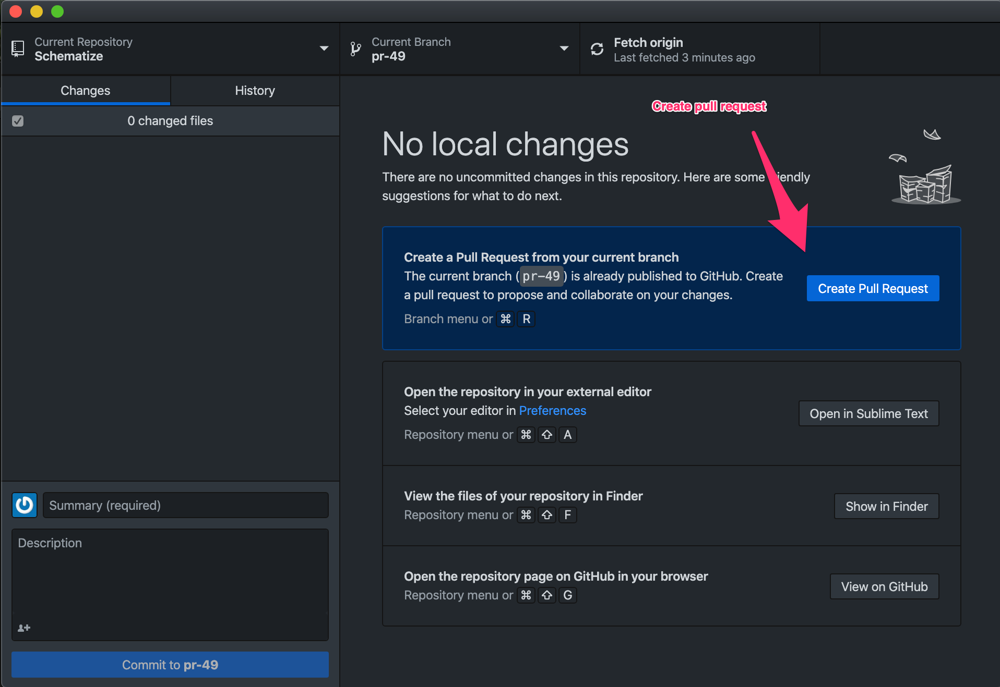

# Create a Pull Request

Pull Requests are used to control the merging of code into the overall code base.
It is important to ensure that each set of commits is thoroughly tested to protect
the quality and integrity of the master branch.

There will be a limited number of people with merge access on the project repositories.
We expect to have a large number of developers modifying code on this open source 
project.

This process will be used to incorporate the changes from many developers into one
master code base.

## Start with a Forked Repo

* Fork the repo you want to modify. This gives you a private copy of the code that
lets you pull new changes from the original source.
* Clone the Repo.  Make a cloned copy of the repo on your local machine. This will 
accommodate the changes that you intend to make

## Create a New Branch Your Changes

* Make a new branch in your repo to carry your changes.  This lets you separate 
many types of changes that you are working on without being confused.

    git checkout -b my-new-branch master
    

## Modify Your Version

* Edit any code that you want.
* Commit your changes. This will modify your local repository.
* Push your changes to Github. This will modify your forked repository.

## Create Pull Request

If you are using Github Desktop it is very easy to create a new pull request.

* Describe your set of changes.
* Describe how to test your changes.

Work the following sequence

* Create a branch to merge into master
* Create a PR using Github Desktop
    * Add info via website
* Merge in PR
* Capture screenshots
* Add to documentation

