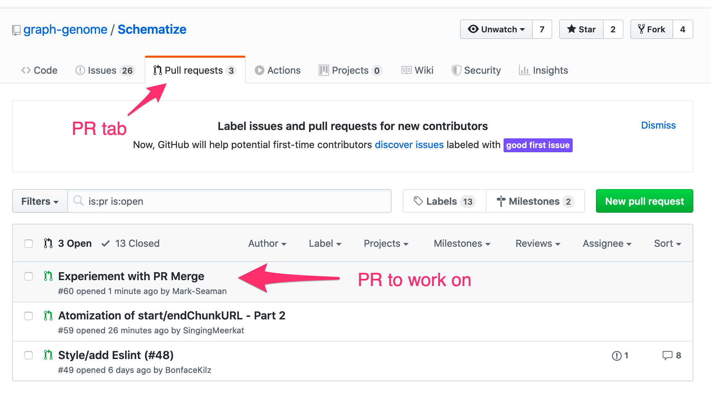
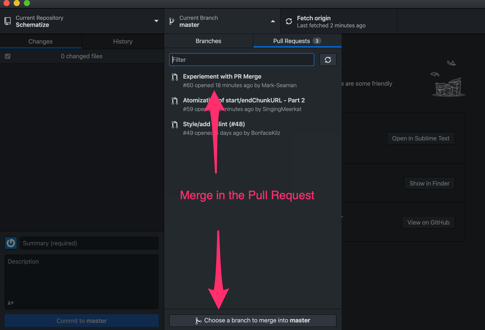
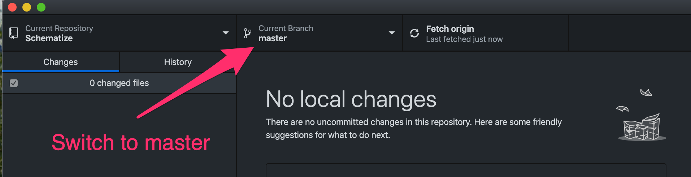
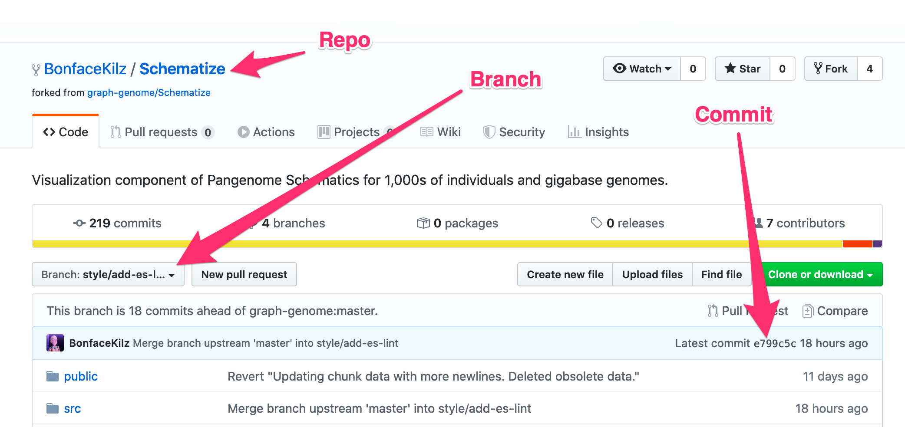
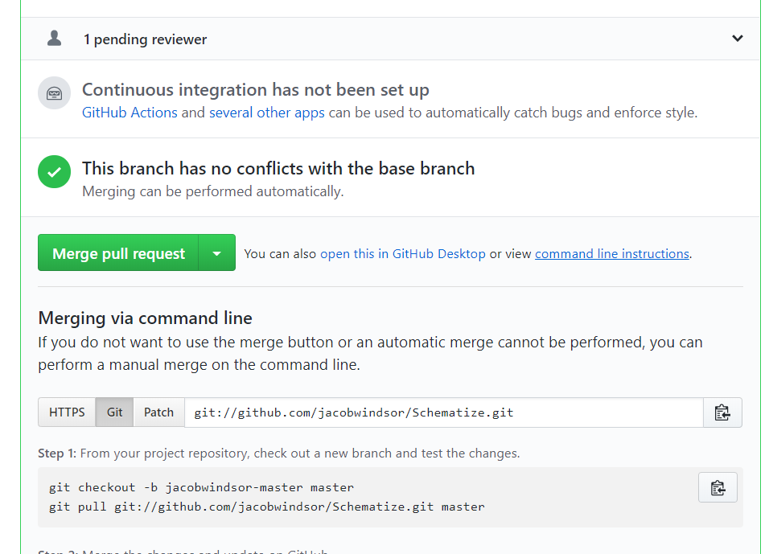

# Merge a Pull Request

How to process a pending pull request.

## Integrate Code from Pull Request

### Select Pull Request

Go to the Pull Request tab in the Github repo

Review the PRs

### Merge using Github Desktop

Checkout the master branch

Merge in code from the test branch

### Read Pending Pull Request

* Identify the repository, branch, and the commit for the pull request.

### Get code from Same Repo

If the commit being merged is within the same repo then a simple command will get the code.

    git checkout pull-request-SHA1  # PR Commit

### Get code from Forked Repo

If you have write permission to the code then there is a button that shows you the shell commands needed.

*You can find the commands to checkout people's code for testing by clicking "command line instructions" next to the Merge Pull request button.*

### Create a PR Branch

Create a new branch in Schematize (or other repo).  Each PR can get its own branch so that we can
see them later.

    git checkout -b pr-49 master
    
This command creates a new branch called pr-49 that is build from the current head of master.
    
Get the code from the desired branch.  Git pull does a fetch of the desired repo and merges the 
desired commit into the new branch.

    git pull git@github.com:BonfaceKilz/Schematize.git e799c5ca667cdbd4dbe8db973b81fc8cae7b55ca
    
    git pull git@github.com:[REPO] [COMMIT]  # General Syntax

## Test the Code

* Apply the commit from the Pull Request to the local code.
* Run through the [Test Process](testing)

## Feedback to Developer

* Communicate the issues found during testing to the developer
* Make a decision about whether to merge the Pull Request or wait for further changes

## Merge of Pull Request

* Merge the PR
* Respond to the developer

## File Issues

* Sometimes a Pull Request will get merged even when there are outstanding issues
* It is very important to make sure that these issues are logged immediately

