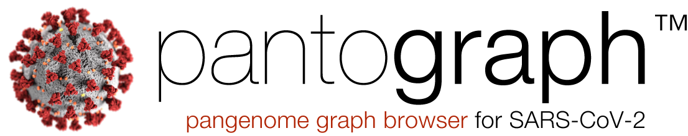
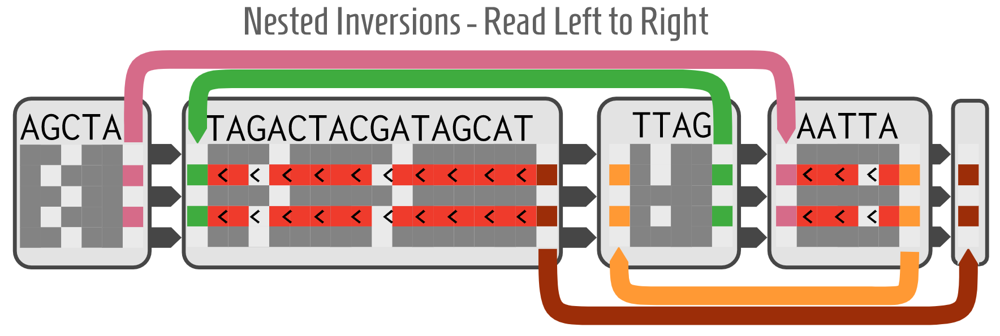
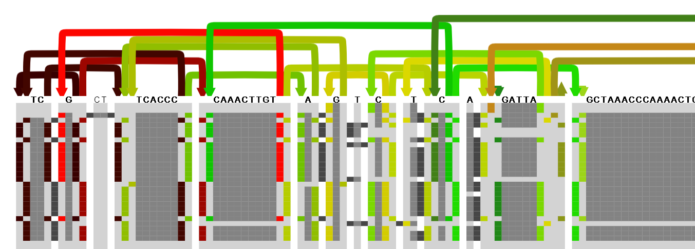
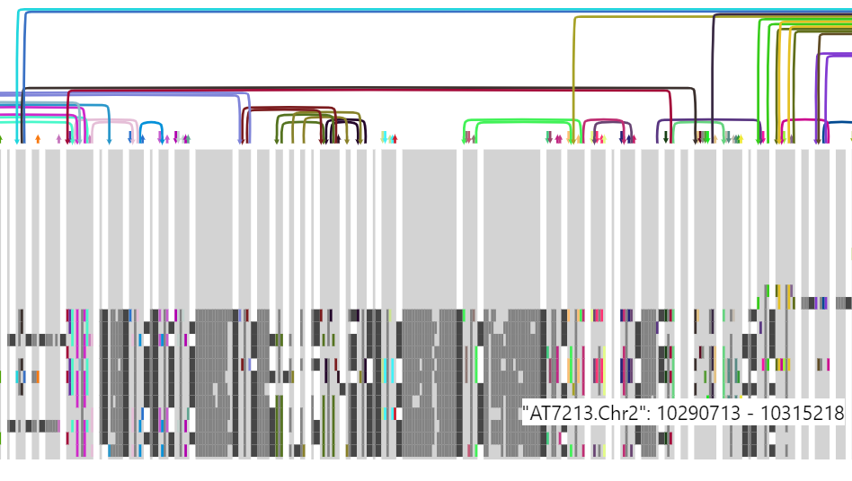

[Project Documents](project.html)

### Pantograph Interview Podcast
    
Interview with Project Lead Josiah Seaman 

<iframe src="https://anchor.fm/Computomics/embed/episodes/Pantograph-SARS-Cov2--Covid-19-genome-browser-ech3sj/a-a1ss2d5" height="102px" width="400px" frameborder="0" scrolling="no"></iframe>

### SARS Comparison

*Pantograph comparing different SARS species. SARS-CoV2 is a virus which is new to science. It has minimal overlap with bat viral species. (Early alpha screenshot)*

### COVID-19 Relevance

Pantograph as a project started in 2018 as a way to unlock the next level of population genetics for researchers. Pantograph is a visual browser for Graph Genomes, a new way of capturing sequence data. This process is designed to fix problems common to the sequencing technology that we’ve been using for the past 30 years. For example, Reference Bias means genetic analysis is more accurate for Europeans than for Africans ([Liverpool 2019](https://www.newscientist.com/article/2221957-genetic-studies-have-missed-important-gene-variants-in-african-people/)). A technical paper on Pantograph was being written by a team of 10 scientists before COVID-19 hit. 

Now, Pantograph is even more relevant to the current pandemic. The success or failure of our efforts to fight the COVID-19 disease rely upon the sequence diversity of the virus itself. Tests for infection rely on knowing the exact sequence being tested. A rearrangement in the order of genes, even if the content is the same, will return a false negative test. 

Second, the vaccine targeting the Spike protein on the outside of the virus relies on a lack of genetic diversity in the Spike protein sequence ([NIH clinical trial](https://www.nih.gov/news-events/news-releases/nih-clinical-trial-investigational-vaccine-covid-19-begins)). If there are any strains with a mutant protein, the vaccine could be rendered ineffective and the virus would continue to spread. SARS-CoV-2 is an RNA virus that will likely infect billions of people, giving it a much higher mutation capability than we’ve previously dealt with in pandemics. For example, the common cold is so impossible to irradicate precisely because of the number of people infected and thus the high number of mutations which exist around the globe. Current sequencing techniques may be under-representing the full sequence diversity of the virus because they are reference based. Eliminating reference bias and enabling species genetic diversity on thousands of individuals is the core goal of using a graph genome.

Pantograph is a very small piece in a worldwide effort to eradicate this disease. It is by no means the most important and the disease will likely end without any involvement on our part. However, given the scale of the pandemic, even a tiny improvement or speedup can result in thousands of lives saved. That’s a difference which is worth investing our resources in. Pantograph will continue to be useful in a wide range of disease application after the current crisis is averted, so that we are never caught unprepared again.

Our short-term goal is to extend the Pantograph tool to add features to make it easier to study the SARS-CoV-2 mutants as the situation develops.

*Mockup for Pantograph showing a Nested Inversion using Links for rearrangements.*
## What is the Pantograph Browser?

Scientists frequently use Multiple Sequence Alignment (MSA) to compare many genomes simultaneously and highlight their differences.  MSA works by inserting gaps in all individuals to allow space for unique sequence in one or more individuals. This technique can lead to **Reference Bias** in analyzing diverse sequences. Graph Genomes are a new way of storing an alignment between many sequences that can include **non-linear rearrangements**. For example, the middle of one sequence can be at the beginning of another sequence. Tools for Graph Genomes are still under development and can't reliably scale to thousands of individuals. Pantograph is the first graph genome browser design with the capability to **scale to thousands of individuals** and still show the individual's nucleotide sequence. This means it's uniquely suited to providing a global overview of species genetic diversity with the option to zoom in on small features.

*Nucleotide level view of the Bacteriophage phi1 viral pangenome.*

The complete details of Pantograph and its planned capabilities are available in the 
[Pantograph Specification (Google Document)](https://docs.google.com/document/d/1NEYkRS6Ux1w_v0Soe74FeOAMOxGHOzDun00LdjMi-74/edit?usp=sharing). The key aspects of our approach are:
 1. Use Graph Sorting to find a consensus ordering of elements in the genome 
 2. Separate genome into colinear blocks called Components 
 3. Show SNPs and indels as cells within a Component grid (Matrix) 
 4. use colorful Links anchored at Link Columns to show non-linear rearrangements in the pangenome, possibly shared by many individuals
 6. Enable zooming from nucleotides, to gene regions, to whole chromosomes by binning of sequence content.
 7. Cluster related individuals by sorting the rows into haplotypes

*Early alpha screenshot of Pantograph comparing Arabidopsis thaliana individuals with many rearrangements.*
### Getting Involved
There are a variety of great ways to participate in finding a solution. [Click here for the first steps](getinvolved.md)

### Hackathon - April 5-11

If you're not available right away, but would like to join the team, the Hackathon is a great opportunity. We will be hosting a special event for volunteers to collaborate for one week. We hope to build the software to a point where we can analyze the variations of the SARS-CoV-2 virus by the end of April. Your contribution could be important to helping us stop this killer virus.

Join us to extend Pantograph so that it can be used to help with the COVID-19 outbreak.
[Hackathon Details](hackathon.md)

## Documentation Index
* [Complete Software Specification (gdoc)](https://docs.google.com/document/d/1NEYkRS6Ux1w_v0Soe74FeOAMOxGHOzDun00LdjMi-74/edit?usp=sharing)
* [Pantograph Description](pantograph.html)
* [Communication and Development Tools](tools.html)
* [Project Resources](project.html)
* [Our Team](https://docs.google.com/document/d/19SHq1P6aWBLKxJbMytW-qZEabWLtYVhoBU09C0uZlV8/edit?usp=sharing)
* [Hackathon](hackathon.html)
* [Get Involved](getinvolved.html)
* [Testing Procedure](testing.html)

---
Next: [Communication and Development Tools](https://graph-genome.github.io/tools.html) \[[Index](https://graph-genome.github.io/pantograph.html#documentation-index)\]
