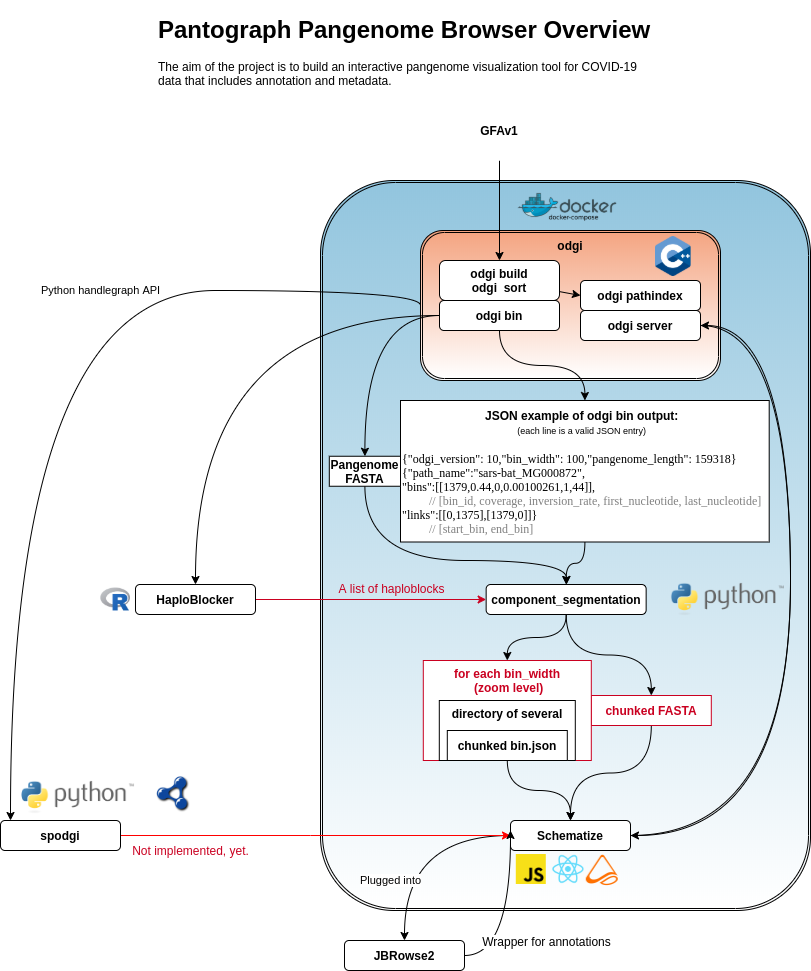

# Introduction or Background

As part of the one week COVID-19 Biohackathon April 5-11 2020, we formed
a working group on the interactive visualization of graphical pangenomes.

TODO intro graphical pangenomes \
TODO intro pantograph pangenome browser

The `Pangenome Browser' working group at the 2020 edition of the
VirtualBioHackathon addressed themselves with different aspects of a pangenome browser:

- TODO item1
- TODO item2

## Component Schematization FAIRification

We added a new schema ontology and RDF output format to Component Schematization, building
on the VG ontology. RDF allows combining data in the visualisation, with arbritary other data encodded in RDF. This allows us to use SPARQL (a generic W3C standard graph query language) queries to allign components, bins and other visual artifacts with genome, protein and chemical annotations using SPARQL.

## COVID-19 Annotated Pangenome graph

The pangenome graphs build from sequences deposited in INDSC are serialized as RDF and loaded into https://covid-19-sparql.expasy.org. This SPARQL endpoint contains the pangenome, as well as the annotated sequences from INDSC, the annotated protein sequences from UniProt. Receptors, by UniProt and NeXtProt, as well as close orthologes from OMA and expression data from Bgee.

This query system allows us to ask varied questions of the data in combination with the FAIR Component Schematization. Queries, such as in this variant, what are the annotations present in the mainline sequences but missing here.

## Tables, figures and so on

Please remember to introduce tables (see Table 1) before they appear on the document. We recommend to center tables, formulas and figure but not the corresponding captions. Feel free to modify the table style as it better suits to your data.

Table 1
| Header 1 | Header 2 |
| -------- | -------- |
| item 1 | item 2 |
| item 3 | item 4 |

Remember to introduce figures (see Figure 1) before they appear on the document. 

 
Figure 1. A figure corresponding to the logo of our BioHackrXiv preprint.

# Other main section on your manuscript level 1

Feel free to use numbered lists or bullet points as you need.
* Item 1
* Item 2

# Discussion and/or Conclusion

We recommend to include some discussion or conclusion about your work. Feel free to modify the section title as it fits better to your manuscript.

# Future work

And maybe you want to add a sentence or two on how you plan to continue. Please keep reading to learn about citations and references.

For citations of references, we prefer the use of parenthesis, last name and year. If you use a citation manager, Elsevier – Harvard or American Psychological Association (APA) will work. If you are referencing web pages, software or so, please do so in the same way. Whenever possible, add authors and year. We have included a couple of citations along this document for you to get the idea. Please remember to always add DOI whenever available, if not possible, please provide alternative URLs. You will end up with an alphabetical order list by authors’ last name.

# Jupyter notebooks, GitHub repositories and data repositories

* Please add a list here
* Make sure you let us know which of these correspond to Jupyter notebooks. Although not supported yet, we plan to add features for them
* And remember, software and data need a license for them to be used by others, no license means no clear rules so nobody could legally use a non-licensed research object, whatever that object is

# Acknowledgements
Please always remember to acknowledge the BioHackathon, CodeFest, VoCamp, Sprint or similar where this work was (partially) developed.

# References

Leave thise section blank, create a paper.bib with all your references
<!--stackedit_data:
eyJoaXN0b3J5IjpbMTI4NzEwNDQ1NywtMjEzMTcwODcwNiwtMT
MxNjE0ODA2NiwzNDk3MTkxMTgsNDEwMzM4MTMsLTg2NDUwNTMw
MSwxNDc4NDMwMjkyLC0xMzYyMTUxMTgxLC0yMTM5MDUyMzQyXX
0=
-->
