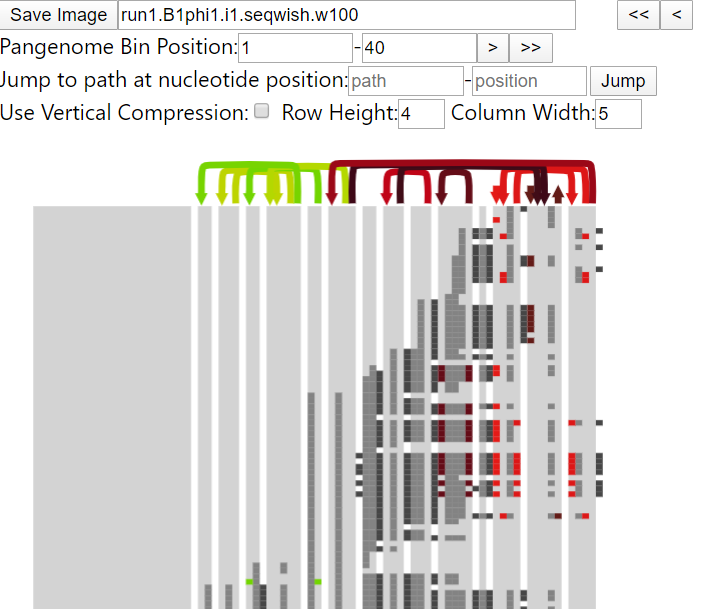

[Project Documents](project.html)

# Basic User Test

---

## Schematize Testing

This process describes the steps for testing each Pull Request (PR) submitted by a contributor.  In the Schematize Browser, we want to make sure that changes are compatible with each other and don't introduce new bugs.

### Integrate code from Pull Request

If the commit being merged is within the same repo then a simple command will get the code

    git checkout pull-request-SHA1  # PR Commit
    

### Checkout from Fork Repo

*You can find the commands to checkout people's code for testing by clicking "command line instructions" next to the Merge Pull request button.*

### Run Schematize

* Pull code from contributor's repo (GitHub image below).
* `npm install` (Please note if the PR introduces a new npm package requirement).
* `npm start` Code should compile and launch browser window.

### Test Cases

Manual Testing is done by stepping through each test case and making sure that everything is working correctly.
1. `npm start` runs and loads code into the browser window automatically.
2. Browser window should show the expected test pattern.
3. Browser refresh reloads the view.
4. Browser window should show Input widgets at top: filename, start bin, left and right buttons, path name, position, jump button, Use Vertical Compression, Row Height, Column Width.
5. Browser window starts populated with a graphic showing the current data.
6. Light grey blocks for coverage (shouldn't be everywhere). Dark grey connectors in between Components (light grey background boxes).  
7. Links appear as colorful arrows immediately above the Component boxes.
8. Link Color matches Box Color in the Column immediately below either end of the link.
9. Links horizontal runs stack up neatly without overlapping (broken in current screenshot).  
10. Mouse over Link and it changes to black.
11. Click Orphan Link (only one small arrow).  View should jump to corresponding section with the other side of the link and matching color.  
12. Matching link is visually highlighted ([#6](https://github.com/graph-genome/Schematize/issues/6) not implemented yet).
13. Clicking on the newly highlighted link should take you back to precisely where you came from (2-way link travel) with your orphan link centered in the view.
14. Mouseover cells (grey blocks) should show e.g. "Path_name: 2365-27289. Coverage: 0.23, Inversion: 0.0".  Mouseovers should be different for each cell. Mouseover disappears when not over cell.

### Sample Schematize Page

#### Testing steps to add once features are implemented:
* Link mouseovers
* Path position "Jump" (requires odgi setup or online server)

---

## Python Testing for component_segmentation

1. Pull code from contributor's repo (GitHub image above).
2. `pip install -r requirements.txt` (Please note if the PR introduces a new package requirement).  You should be using Python 3.7.* to test.
3. `python segmentation.py --json-file=data/run1.B1phi1.i1.seqwish.w100.json --out-folder=data/ --cells-per-file=5000`
4. New files should be created in /data/
5. bin2file.json should list the names of all the chunkXX.json files
6. Contents should be valid JSON.  
7. Header with json_version should match the target version of the issue. This is especially important for issues that change the format.

